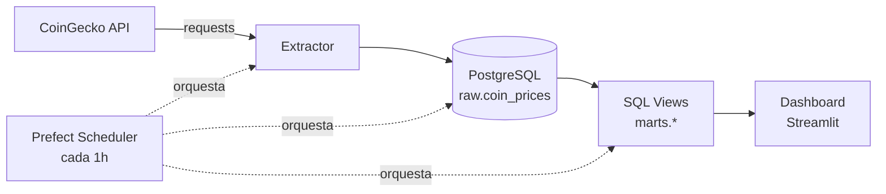
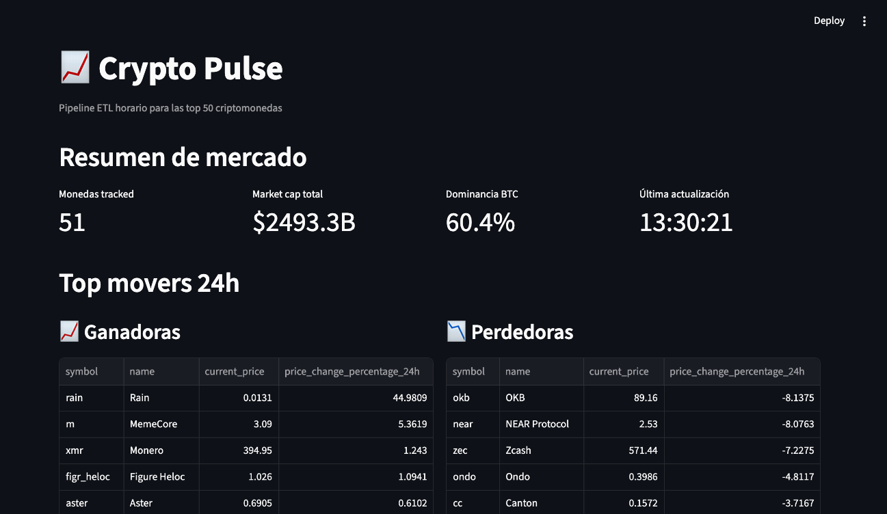
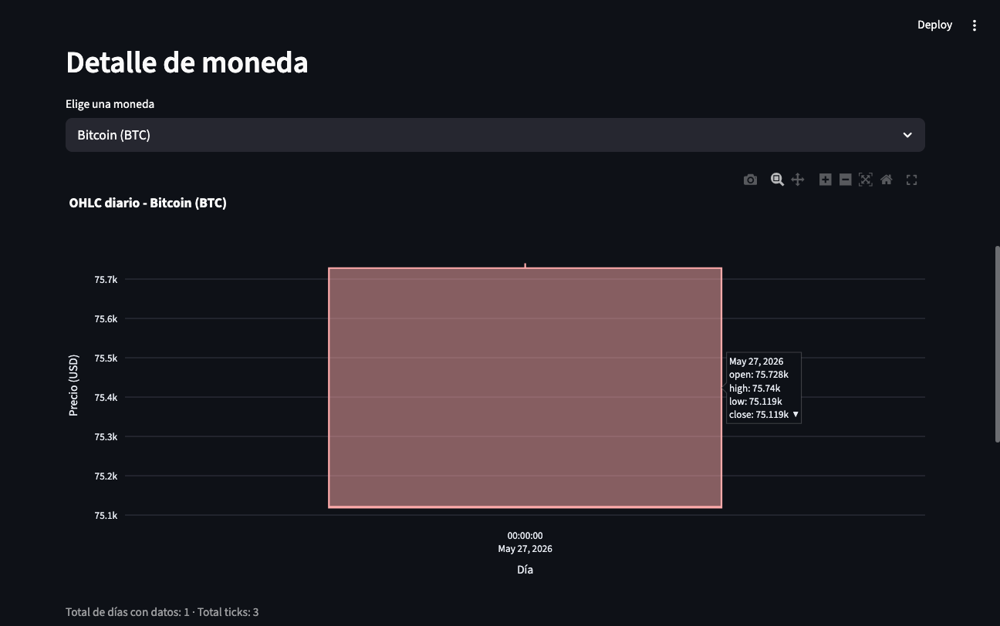

# 📈 crypto-pulse

[](https://github.com/Antoniojesus122/crypto-pulse/actions/workflows/ci.yml)
[](https://www.python.org/downloads/)
[](LICENSE)

> Pipeline ETL horario para las top 50 criptomonedas. CoinGecko API → Postgres → Dashboard Streamlit. Construido con Python, Prefect y Docker.

Proyecto de portfolio de **Data Engineering**: ingesta automatizada de precios cripto, modelado relacional en capas `raw`/`marts`, orquestación con Prefect y dashboard interactivo.

---

## 🎯 Qué hace

Cada hora, el pipeline:

1. **Extrae** los precios de las top 50 criptomonedas desde la API pública de CoinGecko.
2. **Carga** los datos en una tabla `raw.coin_prices` de PostgreSQL (histórico).
3. **Transforma** con vistas SQL (`marts.coins_latest`, `marts.top_movers_24h`, `marts.daily_ohlc`, `marts.volatility_7d`).
4. **Refresca** las vistas materializadas.
5. **Sirve** un dashboard Streamlit con métricas, top movers y gráficos OHLC interactivos.

## 🏗️ Arquitectura



## 🧰 Stack

| Capa | Tecnología |
|---|---|
| Lenguaje | Python 3.11+ |
| Orquestación | Prefect 2 |
| Base de datos | PostgreSQL 16 |
| Transformaciones | SQL (vistas + vistas materializadas) |
| Dashboard | Streamlit + Plotly |
| Contenedores | Docker Compose |
| Tests | pytest + pytest-cov + pytest-mock |
| Lint | ruff |
| CI | GitHub Actions |

## 🚀 Quick start

Requisitos: Docker, Python 3.11+, Git.

```bash
# 1. Clonar e instalar
git clone https://github.com/Antoniojesus122/crypto-pulse.git
cd crypto-pulse
python3 -m venv .venv && source .venv/bin/activate
pip install -e ".[dev]"

# 2. Levantar Postgres
cp .env.example .env
docker compose up -d

# 3. Ejecutar el pipeline una vez
python -m crypto_pulse.flows

# 4. Lanzar el dashboard
streamlit run dashboard/app.py
```

Abre http://localhost:8501.

## 📊 Capturas




## 🗂️ Estructura del proyecto

```
crypto-pulse/
├── src/crypto_pulse/      # código del pipeline
│   ├── config.py          # settings con pydantic-settings
│   ├── extractor.py       # llamadas a CoinGecko
│   ├── loader.py          # inserts en Postgres con SQLAlchemy
│   └── flows.py           # orquestación con Prefect
├── sql/
│   ├── 01_schemas.sql     # raw + marts
│   ├── 02_raw_tables.sql  # tabla coin_prices con índices
│   └── 03_marts_views.sql # 4 vistas analíticas
├── dashboard/
│   └── app.py             # app Streamlit
├── tests/
│   ├── test_extractor.py  # unit tests con mocks
│   └── test_loader.py     # unit + integration tests
├── .github/workflows/ci.yml
├── docker-compose.yml
└── pyproject.toml
```

## 📐 Modelo de datos

**Capa RAW** (datos crudos de la API):

- `raw.coin_prices` (id, symbol, name, current_price, market_cap, …, ingested_at)

**Capa MARTS** (datos listos para consumo):

- `marts.coins_latest` — último snapshot por moneda (vista normal)
- `marts.top_movers_24h` — top 10 subidas + top 10 bajadas (vista normal)
- `marts.daily_ohlc` — OHLC diario por moneda (vista materializada)
- `marts.volatility_7d` — coeficiente de variación 7d (vista materializada)

## 🧪 Tests

```bash
pytest                    # todos los tests
pytest -v                 # verboso
pytest --cov              # con cobertura
ruff check src tests      # lint
```

Cobertura actual: **>80%** en módulos del pipeline. Postgres real en tests de integración usando una fixture que trunca la tabla antes/después.

## ⚙️ Decisiones técnicas

- **Prefect 2 vs Airflow**: Prefect para arrancar (DX más amable, menos boilerplate). Airflow vendrá en el siguiente proyecto.
- **SQLAlchemy Core vs ORM**: Core porque mantiene cercanía al SQL real (más educativo y más típico en DE).
- **Vistas normales vs materializadas**: las que necesitan frescura instantánea son normales (`coins_latest`, `top_movers_24h`); las que cachean datos pasados son materializadas (`daily_ohlc`, `volatility_7d`).
- **Streamlit vs Metabase**: Streamlit porque es código (versionable, deployable, customizable). Metabase sería ideal para dashboards corporativos.

## 🛣️ Roadmap

- [ ] Deploy del dashboard en Streamlit Community Cloud
- [ ] Migrar transformaciones a dbt
- [ ] Añadir tests de calidad de datos con Great Expectations
- [ ] Recoger datos en streaming con websockets de Binance
- [ ] Migrar orquestación a Airflow

## 📝 Licencia

MIT — ver [LICENSE](LICENSE).
